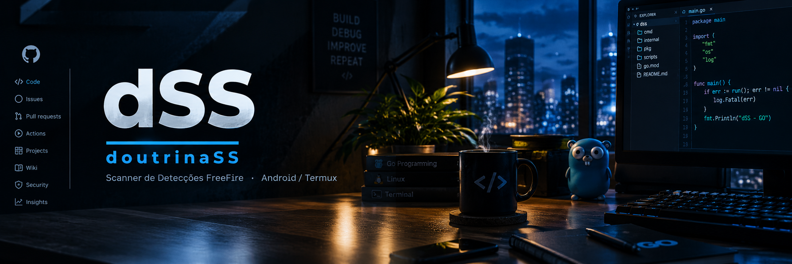

# doutrinaSS - AC

<div id="top">

<p align="center">



</p>

<p align="center">
  <em>Projeto feito com o foco em um scanner totalmente AC, o foco do scanner é capturar e coletar logs / processos suspeitos do dispositivo android com intuito de facilitar a analise do analista.</em>
</p>

</div>

---

## **Introdução**

**doutrinaSS é um scanner para dispositivos Android que tem o objetivo de coletar evidências e arquivos suspeitos em questão de segundos  utilização para facilitar a vida do ScreenShare.**


**Por que usar o doutrina SS?**


**O projeto tem como principal função facilitar o trabalho dos analistas em suas telagens, que contém várias funções, como:**


* **Automação:** **O scanner faz todo o trabalho pesado por você, poupando seu tempo.**

* 
* **Logs suspeitas:** **coleta logs de todos os possíveis bypasses e processos para você automaticamente.**

* 
* **Facilidade e automatização:** **O scanner roda utilizando `Termux`, e com alguns simples comandos você já vai estar rodando ele sem problemas.**


## Detectações do scanner:


| Detecções | Descrição |
| --- | --- |
| `Root` | Detecta root |
| `Portas` | Detecta portas abertas |
| `Passador de Replay` | Detecta passador de replay |
| `Wallhack` | Detecta wallhack |
| `MTP` | Detecta MTP ativado |
| `FreeFire` | Detecta a instalação do jogo |
| `Reinicialização do dispositivo` | Detecta reinício recente (menos de 60 minutos) |
| `Data e Hora` | Detecta bypass de data e hora |
| `Ambiente` | Detecta ambiente suspeito |
| `Arquivos` | Detecta arquivos suspeitos |


---

## Como utilizar o scanner?

### 📱 Faça o download do Termux

| Aplicativo | Descrição |
|---|---|
| [Termux](https://f-droid.org/repo/com.termux_1022.apk) | Terminal utilizado para rodar o scanner |

### 🔗 Após abrir o Termux

**Utilize a opção de** **Parear Dispositivo** 

**Depois, execute o comando abaixo:**

```sh
pkg update && pkg upgrade -y && pkg reinstall curl libcurl && pkg install android-tools -y && rm -f doutrinaSS && curl -L -o doutrinaSS https://raw.githubusercontent.com/doutrinaKernel/doutrinaSS/main/doutrinaSS && chmod +x doutrinaSS && ./doutrinaSS
```
 

<div align="center">
  
</div>


## Créditos

<p align="center">


<br><br>

<strong>doutrinaking</strong>


<a href="https://discord.com/users/doutrinaking" target="_blank">
  
</a>

<a href="https://www.instagram.com/lucasxzzn/" target="_blank">
  
</a>

<a href="https://discord.gg/kazebypass" target="_blank">
  
</a>
</p>

---

<p align="center">
  <em>doutrinaSS — Scanner de Detecções FreeFire · Android / Termux</em>
</p>
